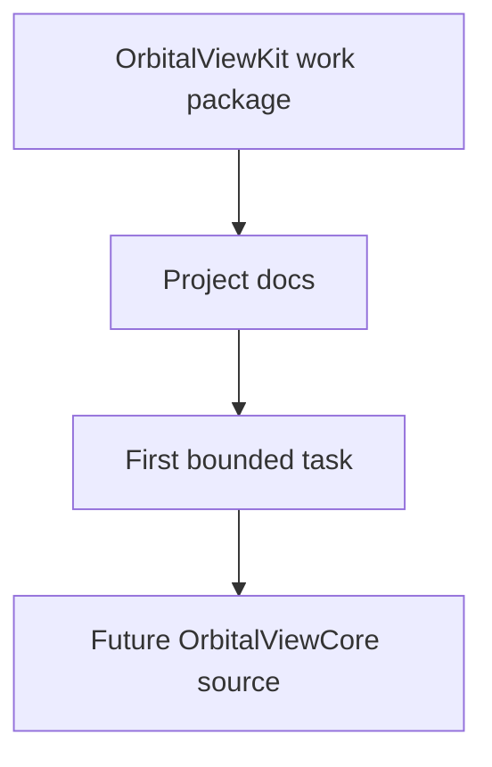
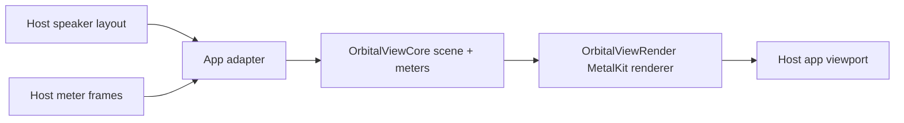
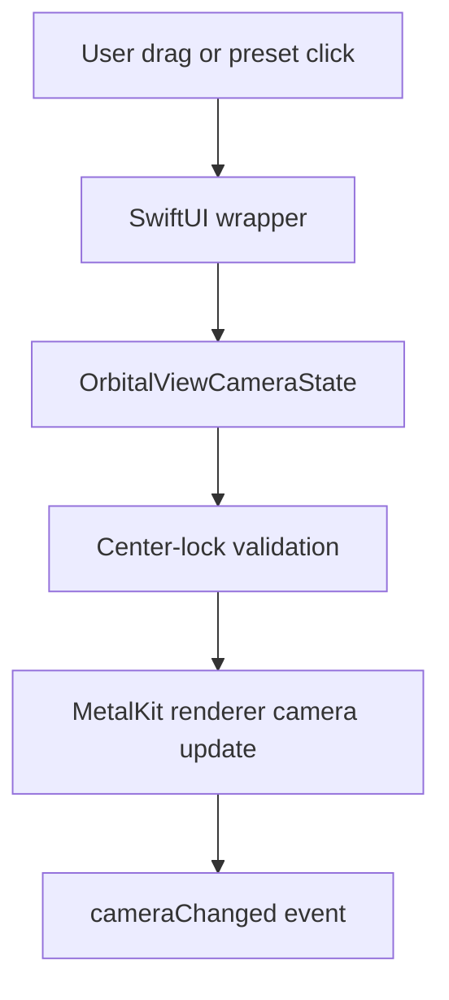
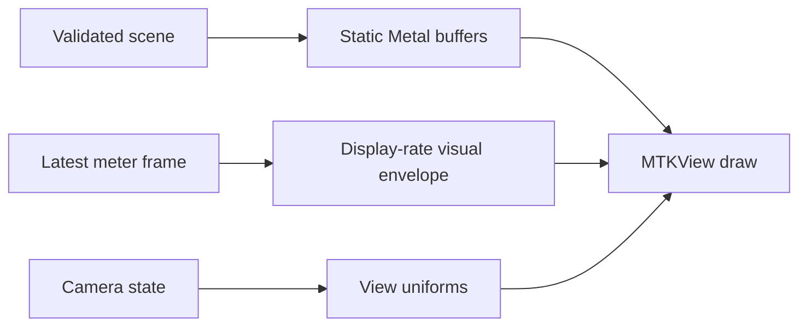
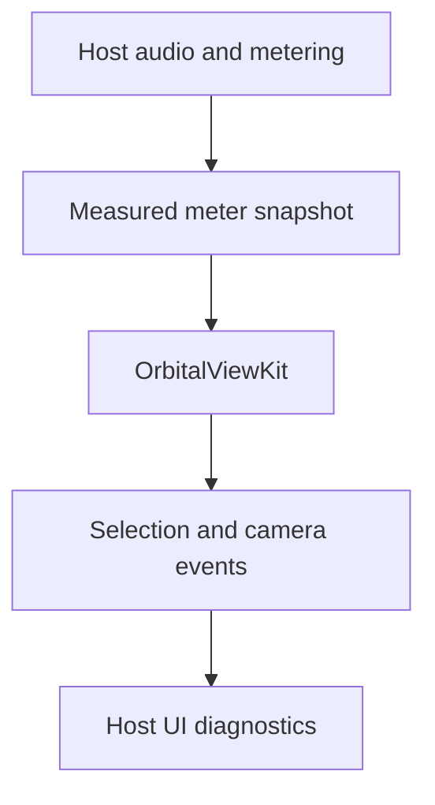

# System Flows

## Current Scaffold Flow

## Future Monitor Data Flow

## Future Camera Flow

## Future Renderer Frame Flow

Static geometry, meter state, and camera state should stay separate so meter updates do not rebuild the scene.

## Boundary Flow

Orbital View Kit consumes measured state and emits UI-facing events. It does not own audio timing, playback, routing, MIDI, OSC, or output behavior.
