# System Flows

## Current Scaffold Flow

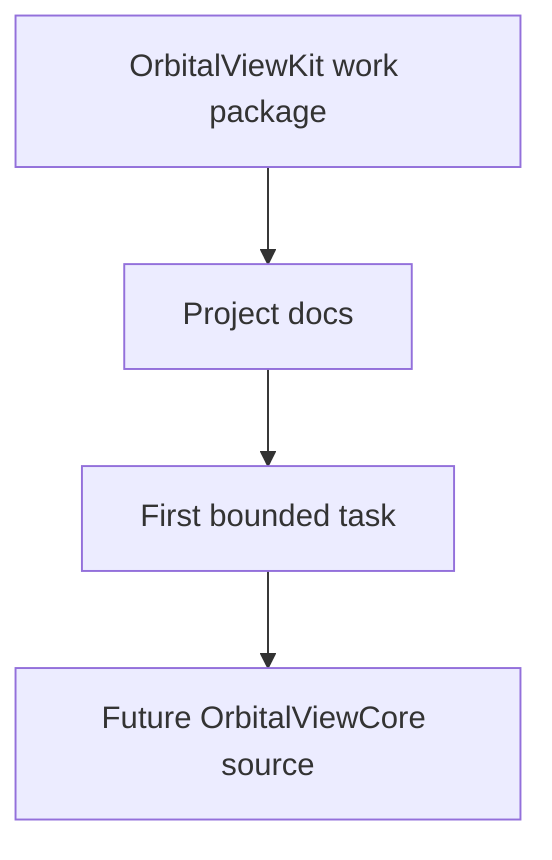

## Future Monitor Data Flow

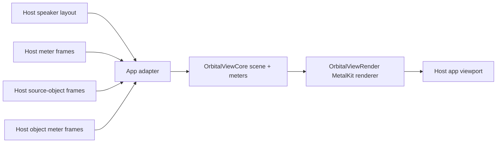

## Current Wavefield Orbital View Flow

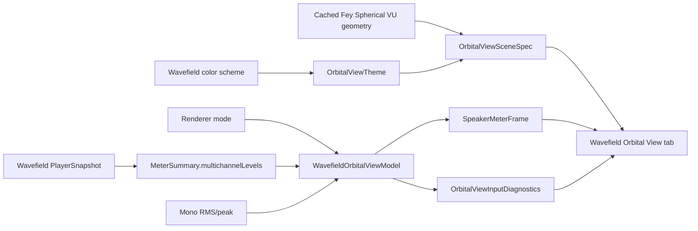

MIDI Track to Speakers, nearest-speaker, and VBAP modes use the measured multichannel levels when present. Mono Equal is the only host-selected mode that mirrors mono RMS/peak into every modeled speaker channel. Empty multichannel levels stay empty and surface diagnostics instead of fake 30-channel values.

## Current Orbisonic Host Contract Flow

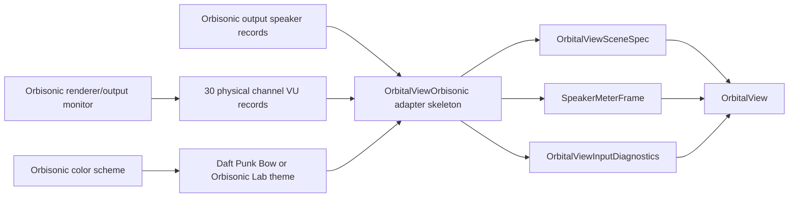

Orbisonic owns renderer/output monitor state, live input capture, output routing, Dante output, Roon/Spotify/Aux source selection, and meter production. `OrbitalViewOrbisonic` owns only the package-level DTO seam from 30 physical speaker records and normalized VU records into `OrbitalViewCore`. The LFE/subwoofer channel remains outside the 30 physical speaker viewport unless a future task explicitly defines a 30.1 visualization.

## Future Camera Flow

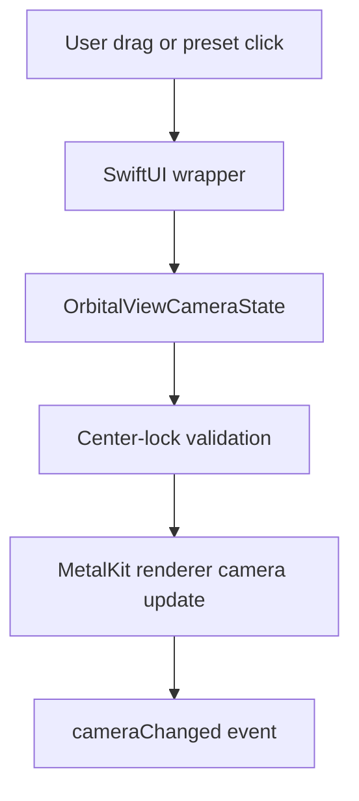

## Future Renderer Frame Flow

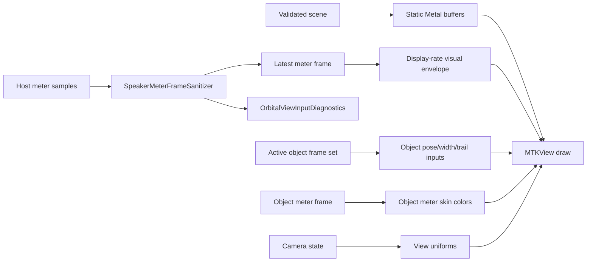

Static speaker geometry, object pose/trail state, meter state, and camera state should stay separate so meter or trail updates do not rebuild the scene.

## Current Meter Input Safety Flow

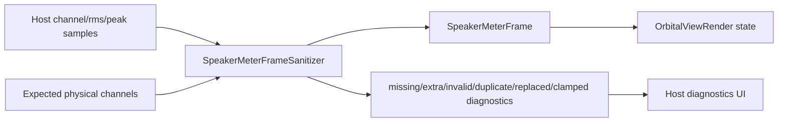

Strict meter constructors still reject invalid timestamps, channels, and non-finite values. The sanitizer is the runtime-safe adapter path for host UI surfaces that should keep running when a bad sample appears.

## Current Renderer Seam Flow

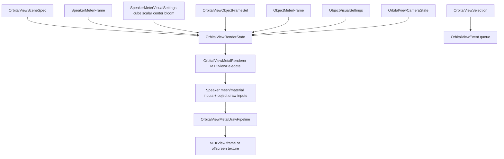

The current renderer seam stores validated state, emits camera/selection events, applies display-only speaker and object visual settings, renders speakers as fixed cube/prism meshes with shader-side center bloom, and keeps object overlays on the simpler quad draw path.

## Current Renderer Invariant Flow

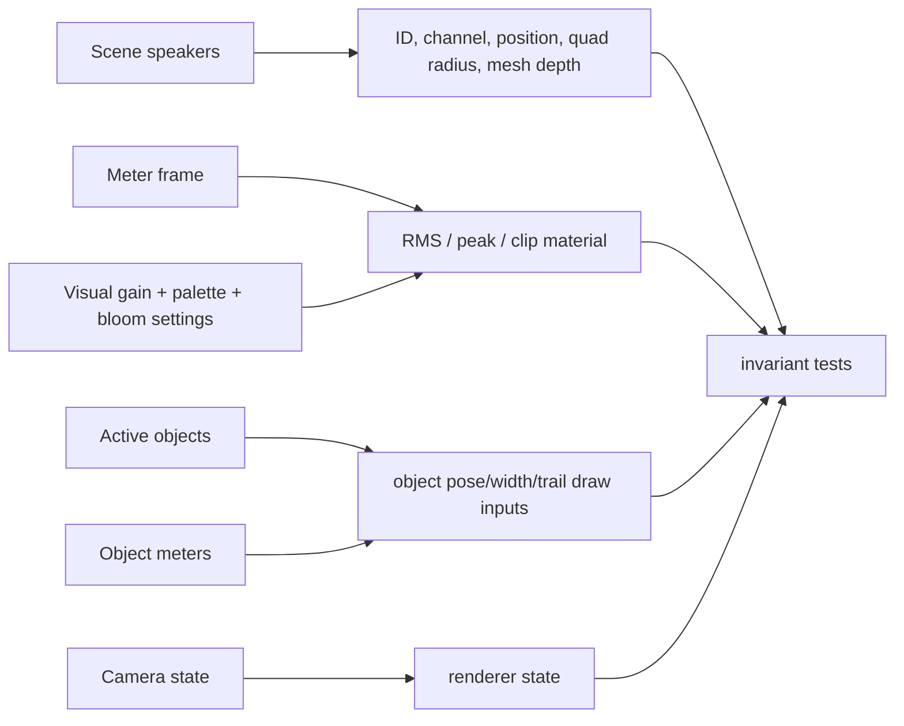

Meter, object meter, trail, and camera updates must not change the static speaker draw inputs. Speaker meter and display-setting changes affect dynamic material/ramp data only; speaker z-scale settings do not mutate scene speaker shapes. Object disappearance is represented by removal from the active object frame set, which also removes trail draw-input ownership.

## Current Object Overlay Flow

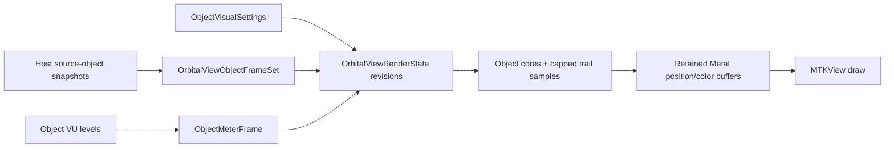

Object centers stay canonical unit-sphere directions. The render/effect bounds default to `-5...+5` on x, y, and z; clipping affects object trails/glow/debug visuals, not canonical poses.

## Current SwiftUI Wrapper Flow

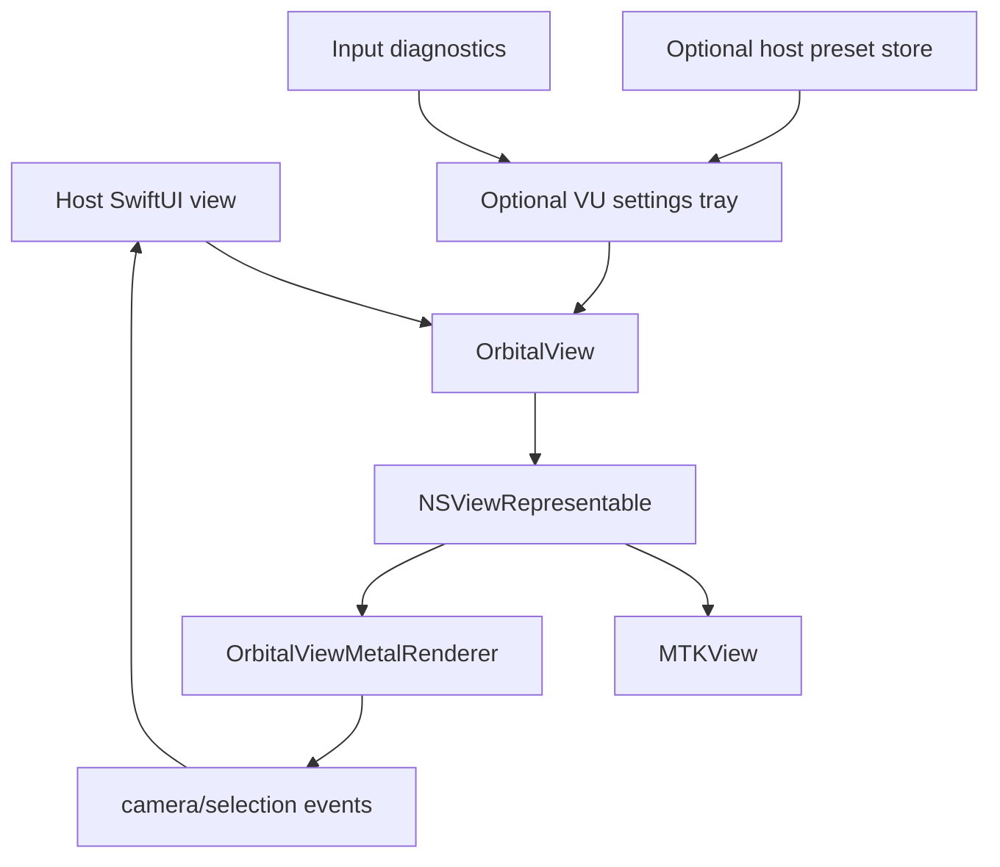

The current wrapper bridges state into the renderer seam and can show an optional collapsed VU settings tray with Basic, Advanced, Presets, and Diagnostics sections. Preset persistence is optional and host-provided through `OrbitalViewVisualPresetStore`; diagnostics are host-provided through `OrbitalViewInputDiagnostics`. The wrapper forwards object snapshots and settings without per-frame SwiftUI-owned animation state. It does not implement toolbar controls, gestures, hit testing, or inspector UI yet.

## Current Standalone Native 3D Viewer Flow

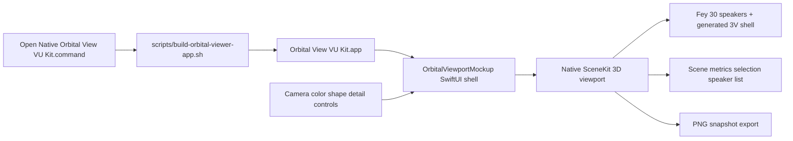

The standalone app launches the native SwiftUI/SceneKit review viewport without a downstream host app. Its controls use Orbisonic design language native SwiftUI/AppKit-backed controls; the browser mockup is only a loose behavior/control-inventory reference. The SceneKit viewport keeps sphere content static, orbits the camera around the origin, and uses SceneKit camera-space fog while hidden-line visibility stays separate. Its 30-channel levels are a deterministic fake meter stream for review parity only; they are not a production meter source and do not touch audio, routing, playback, MIDI, OSC, output, or downstream app code. The package-local `OrbitalViewViewerSupport` deterministic data remains available for tests and future review surfaces.

The standalone interaction polish keeps the preferred full-width native button groups, single-track value-hidden sliders, and aligned switch columns. Spin advances horizontally in screen space for Plan, Elevation, and Isometric presets, drag uses coordinator-owned start-pose state with the requested vertical direction, mouse-wheel zoom uses the requested direction, fog density `0` disables all fog/fallback fade behavior, and Export PNG writes a timestamped Desktop file with footer feedback.

## Current Offscreen Harness Flow

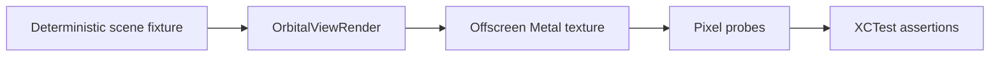

The current drawing harness proves non-empty offscreen output without opening a host app or using live audio.

## Current Browser Mockup Music Flow

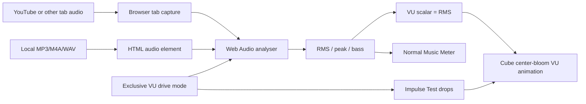

This flow is limited to the disposable browser mockup. Music mode lets the user hear music while the page analyzes browser audio, sets the cube VU scalar equal to the RMS percent, and blooms cube faces outward from that scalar. Peak and bass remain visible diagnostics. Impulse Test mode stops browser audio capture/playback and uses only artificial drops. It does not change `OrbitalViewCore`, `OrbitalViewRender`, `OrbitalViewSwiftUI`, host app routing, or production meter ownership.

## Boundary Flow

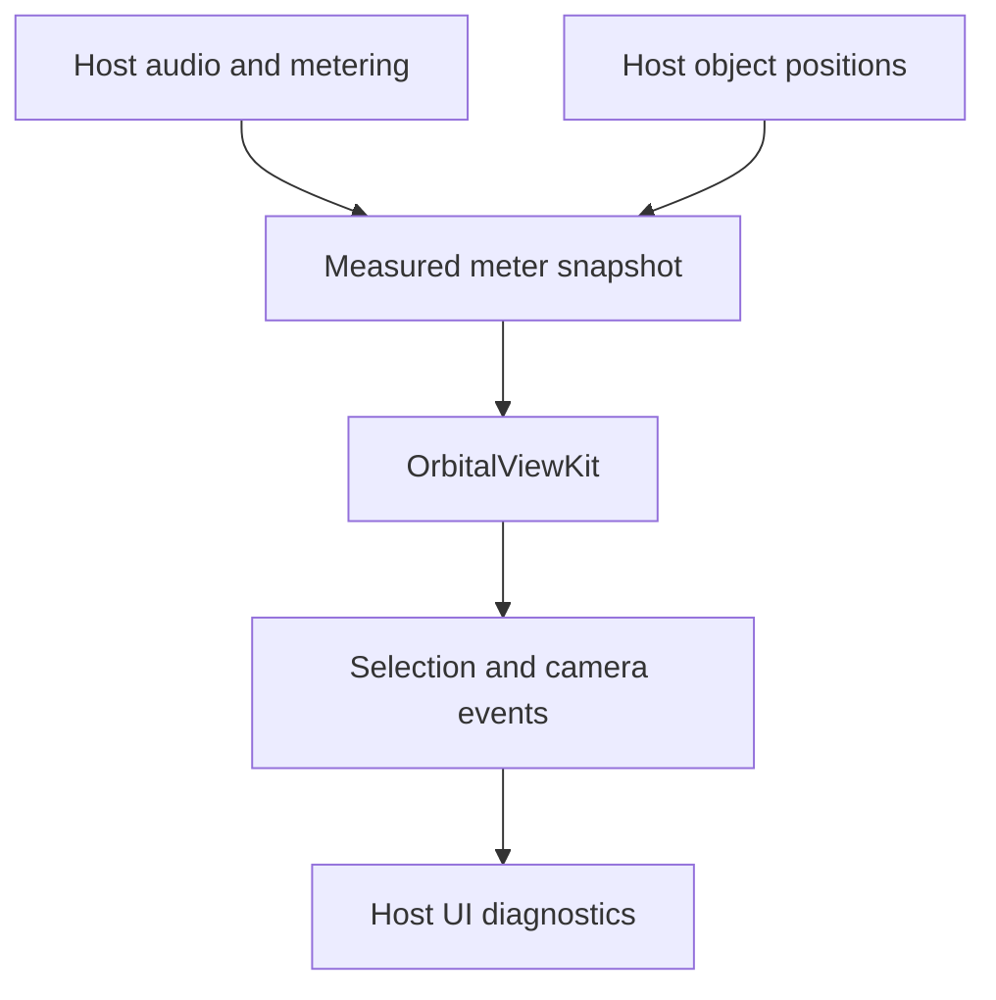

Orbital View VU Kit consumes measured state and emits UI-facing events. It does not own audio timing, playback, routing, MIDI, OSC, or output behavior.
