# System Flows

## Realtime Audio Family Standards Inheritance

This project inherits the Realtime Audio Family Standards Package. The Bencina Realtime Callback Doctrine is mandatory for every callback and every callback-reachable function. Project-specific requirements may add stricter rules but may not weaken the family standard.

Orbital View currently fits the Control / UI / Telemetry Plane plus Preparation Plane adapters. It owns no Realtime Plane and receives host-prepared snapshots rather than direct callback data.

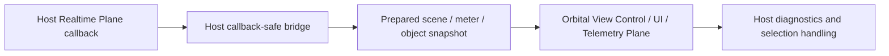

The callback-safe bridge is owned by the host app, not this package. Orbital View must not block, allocate, route audio, schedule playback, or emit MIDI/OSC from a callback path.

## Current Compliance Audit Flow

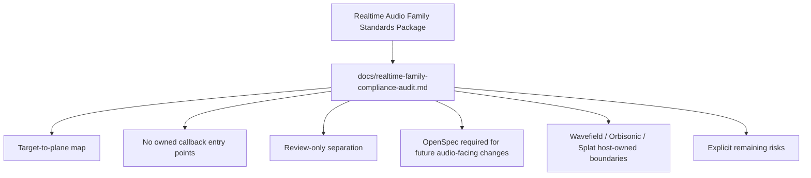

The audit records compliance for Orbital View as a visual telemetry/preparation package. It does not convert renderer, SwiftUI, review, or fixture APIs into callback-safe APIs.

## Current Scaffold Flow

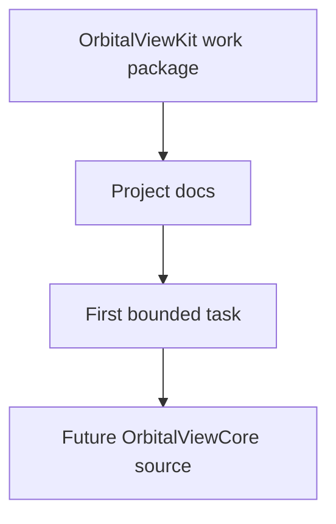

## Future Monitor Data Flow

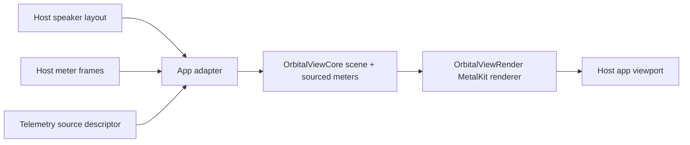

## Future Camera Flow

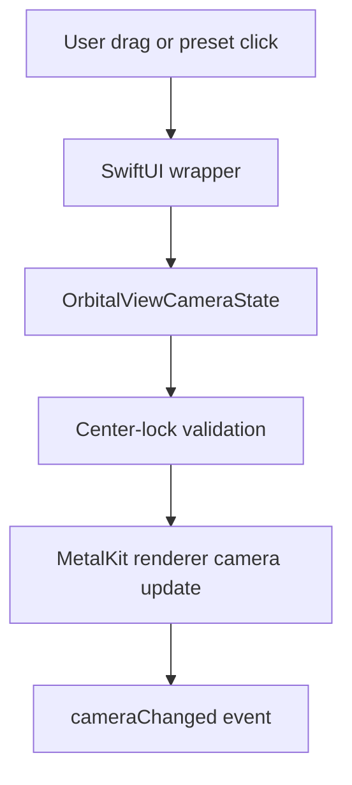

## Future Renderer Frame Flow

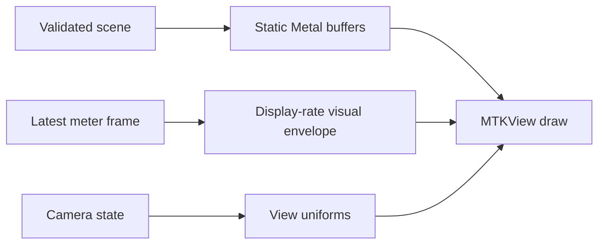

Static geometry, meter state, and camera state should stay separate so meter updates do not rebuild the scene.

## Current Renderer Seam Flow

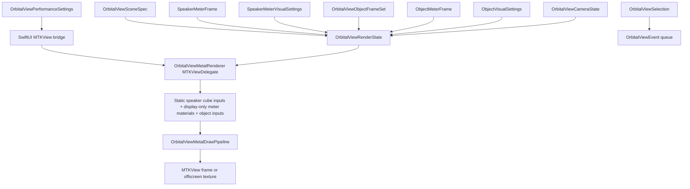

The current renderer seam stores validated state, emits camera/selection events, and issues Metal draw commands for instanced cube/prism speakers plus separate object overlay quads.

## Current Telemetry Source And Overload Flow

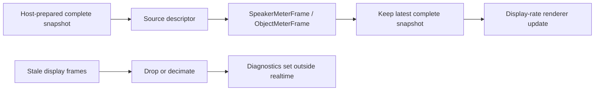

Speaker and object meter frames carry source descriptors such as speaker bus, object bus, final output, hardware tap, local livestream test generator, external Wavefield stream, Orbisonic prepared meter tap, Splat prepared analysis, review local audio, or synthetic visual stress. Overload behavior is lossy on the display side only: stale frames may be dropped, display refresh may be decimated, and diagnostics may be set outside realtime. Audio must never wait for the viewport, callbacks must not allocate more display queue, callbacks must not log or post UI, and raw packets must not enter the renderer.

## Current Visual Telemetry Stress Flow

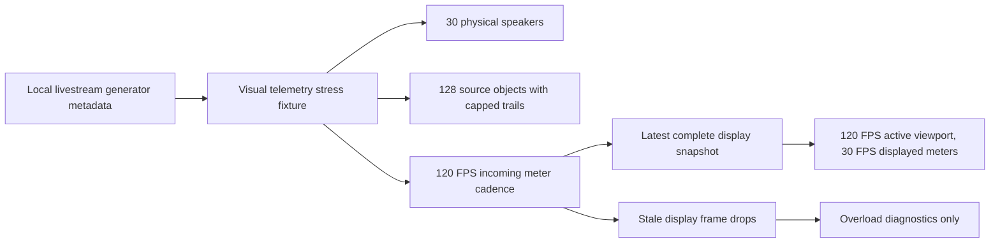

The stress fixture proves display no-backpressure behavior. Dropped display frames are visible as overload diagnostics and are not represented as host audio failure, callback p99 evidence, callback deadline evidence, route repair evidence, device I/O evidence, MIDI/OSC timing evidence, or meter-extraction timing evidence.

## Current Wavefield Realtime Connection Flow

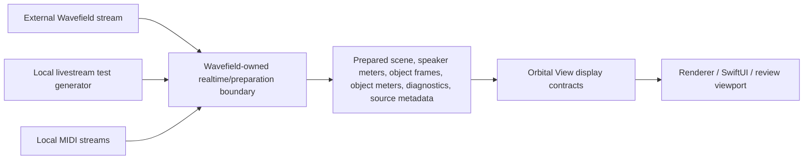

Wavefield owns stream parsing, generator timing, MIDI, realtime event queues, object lifecycle, sample-time scheduling, audio rendering, route validation, meter extraction, and performance gates. Orbital View receives prepared snapshots only. Wavefield object IDs remain object identity, speaker channels remain physical speaker identity, generator profile names remain source metadata, disappeared objects are omitted from active object snapshots, and stale display frames may be dropped.

## Current Orbisonic Host Profile Flow

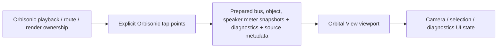

Orbisonic owns playback, transport, device I/O, route discovery, channel mapping, output routing, render/control engines, meter extraction, tap-point selection, operator state, and realtime performance gates. Orbital View receives prepared snapshots, preserves physical channel and object identity, labels Orbisonic meter provenance with `orbisonicPreparedMeterTap`, and follows the Orbisonic design-language palette grammar without owning Orbisonic product behavior.

## Current Splat Host Profile Flow

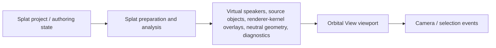

Splat owns edit commands, project/session state, renderer-kernel analysis, file formats, persistence, neutral geometry import/export decisions, and any later handoff to an audio/render host. Orbital View can visualize virtual speakers, source objects, overlays, and diagnostics through prepared snapshots labeled with `splatPreparedAnalysis`. Canonical 3D coordinates remain canonical; permanent flattened screen coordinates are not valid spatial state.

## Current SpatGRIS Layout Flow

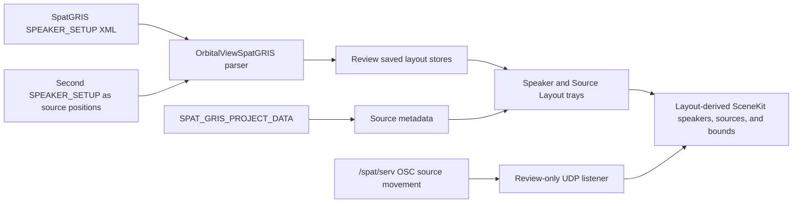

Receiver and source setup files are normalized to current SpatGRIS `SPEAKER_SETUP` XML when saved. Saved rows follow the review theme workflow: refresh, load, set default, manual rename recovery, and invalid-file display. The review UDP listener defaults to port `18032` and validates `1024...65535`; production hosts should pass parsed source-position messages directly and should not depend on review networking.

## Current Renderer Invariant Flow

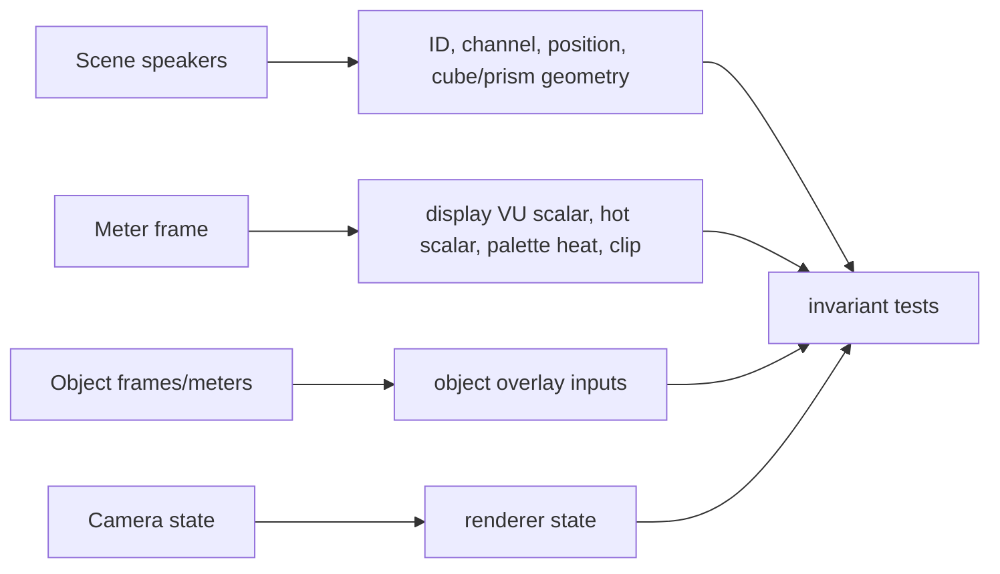

Meter, camera, cube-setting, and object-meter updates must not change static speaker draw inputs. Speaker meters affect display-only material values, while object frames/meters remain a separate renderer layer.

## Current SwiftUI Wrapper Flow

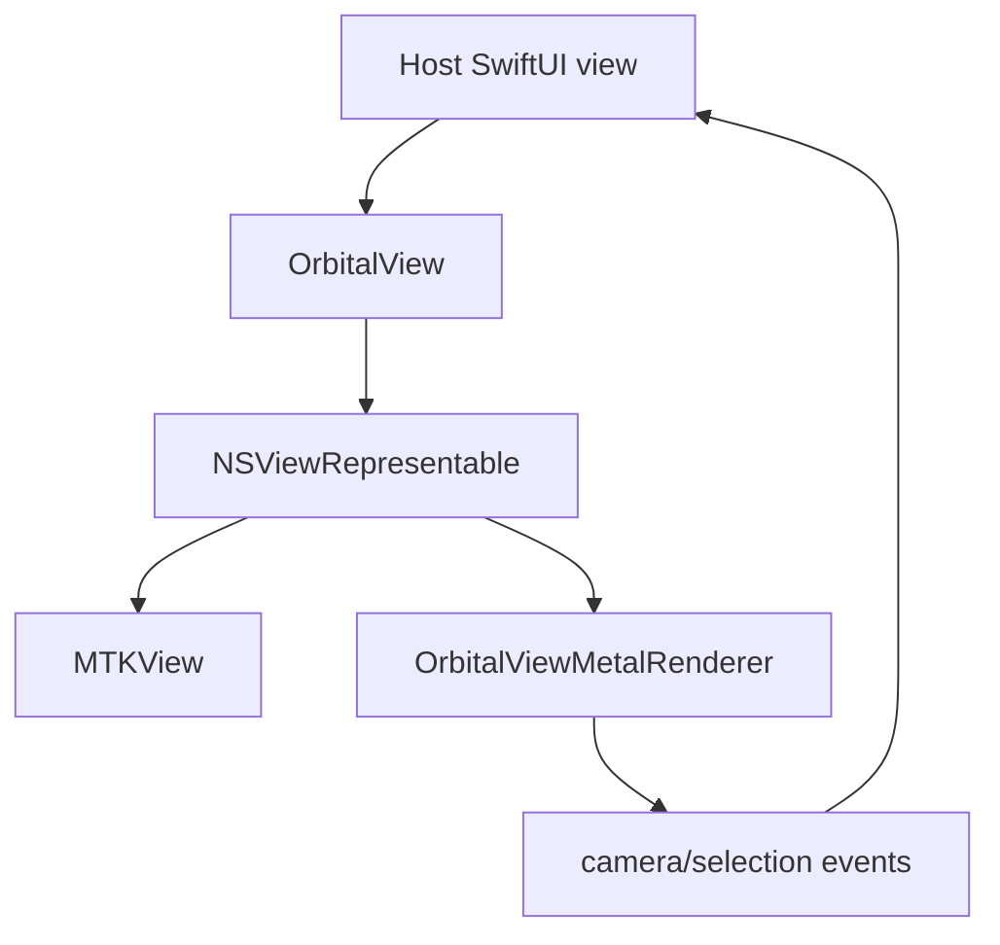

The current production wrapper bridges state into the renderer seam. It does not own SceneKit review tooling, local audio playback, file dialogs, PNG export, theme persistence, toolbar controls, gestures, hit testing, or inspector UI yet.

## Current Review Surface Flow

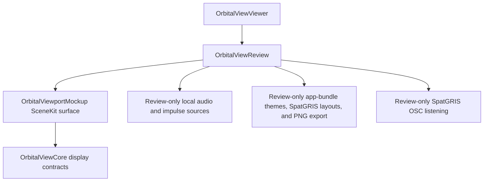

`OrbitalViewReview` owns the review/demo SceneKit surface and its local file playback, PNG export, bundled font, theme behavior, SpatGRIS layout persistence, and review-only OSC listener. Production host apps import `OrbitalViewSwiftUI` instead.

## Current Tuning Tray Flow

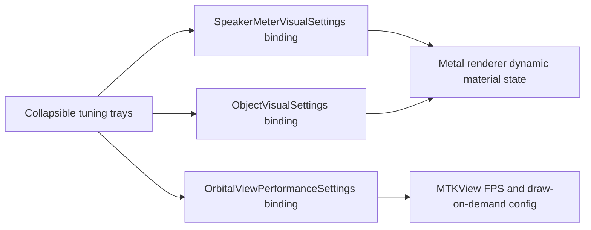

Input, Roll the dice on looks, theme color palette, saved themes, speaker shape, label font and font size, cube surface, bloom style, sphere geometry, sphere palette, ground appearance, meter response, performance, and diagnostics are review-facing controls in the current SceneKit review surface. The left `View Detail` rail owns Speaker Size, Fog Density, Speaker Labels, Hidden Lines, and the display-only Ground Plane on/off switch. The right panel starts with a `Sound Metering Input` header above one expandable `Input` tray, and all collapsible right-panel trays start closed by default; when `Input` is expanded it chooses `Telemetry`, `Local Song`, or `Impulse Test` and owns telemetry details, local song file/transport/render controls, impulse pattern controls, and `Meter Source` status rows. `Speaker and Source Layout` contains the collapsed-by-default `Sonic Sphere Speakers` tray with `Speaker layout in SPAT XML format.` and the collapsed-by-default `Source Speakers` tray with `Source speaker layout in SPAT XML format.` These controls tune visual/render settings only; they do not own host audio, playback, routing, MIDI, OSC, or meter timing. The review-only impulse drives are deterministic synthetic meter sources for visual stress testing and do not change production host meter contracts. Audio-excited render types use the already-computed mono audio RMS/peak sample as a lightweight spatial-pattern envelope. `Theme` now starts with the global `Color Palette` tray, which drives the app skin, physical speaker pixels, source marker pixels, sphere palette, ground palette, and Cube VU ramp together; new theme saves mirror `sourceSpeakerRenderStyle` to the global palette while older JSON still decodes safely. `Sphere Geometry` owns the independent default-off ribbed speaker sphere overlay plus rib thickness/rib/ring controls; `Hidden Lines` off clips that ribbed overlay behind an invisible camera-facing plane that bisects the fitted sphere and hides rear speakers/labels, while `Hidden Lines` on reveals the full sphere context. `Sphere Palette` owns only the sphere palette and saturation that style both ribbed sphere color lanes, and `Ground Appearance` owns ground palette, visibility, spacing, and size controls, but not the on/off switch. Sphere and ground palettes may be locally overridden after a global palette choice; choosing a new global `Color Palette` resets both local palettes to match. The old imported/Fey shell is not rendered in the SceneKit or canvas review paths. Dice-icon randomizers are local to Cube Surface, Bloom Style, and Meter Response, and the global `Roll the dice on looks` action is a centered icon-only button that randomizes view/visual state, including Color Palette, Sphere Palette, and Ground Appearance, while preserving Input state and not saving themes automatically.

## Current Saved Themes Flow

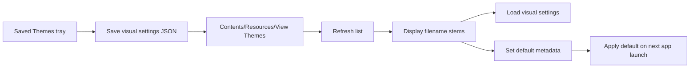

View themes are review-app visual settings only. Loading a theme restores viewport styling, camera/view-detail, speaker label font and font size, Cube VU tuning, source mode, remembered impulse pattern, ribbed speaker sphere visibility/settings, and performance FPS, but it does not restore a local audio file, playback state, telemetry provider, or selected speaker. Legacy `hideSphereStructure` keys decode harmlessly and are ignored.

## Current Offscreen Harness Flow

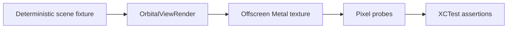

The current drawing harness proves non-empty offscreen output without opening a host app or using live audio.

## Boundary Flow

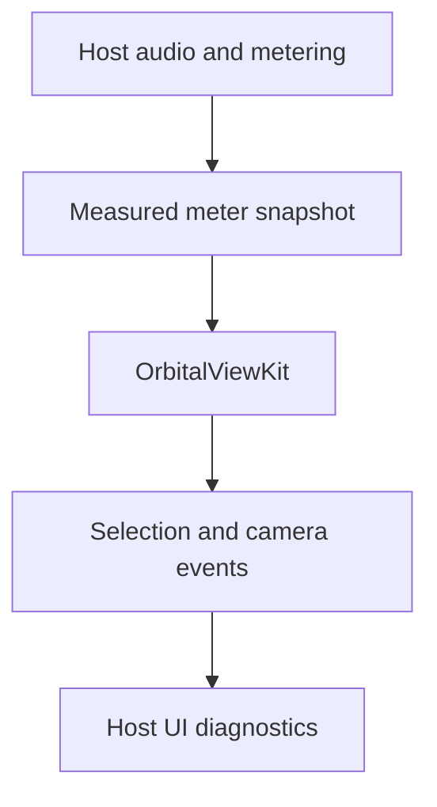

Orbital View consumes measured state and emits UI-facing events. It does not own audio timing, playback, routing, MIDI, OSC, or output behavior.
