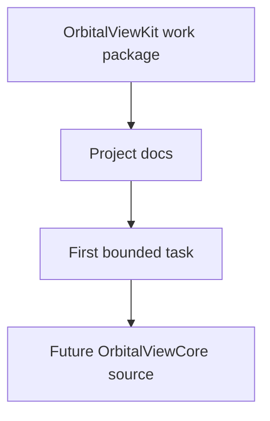
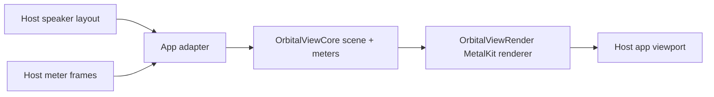
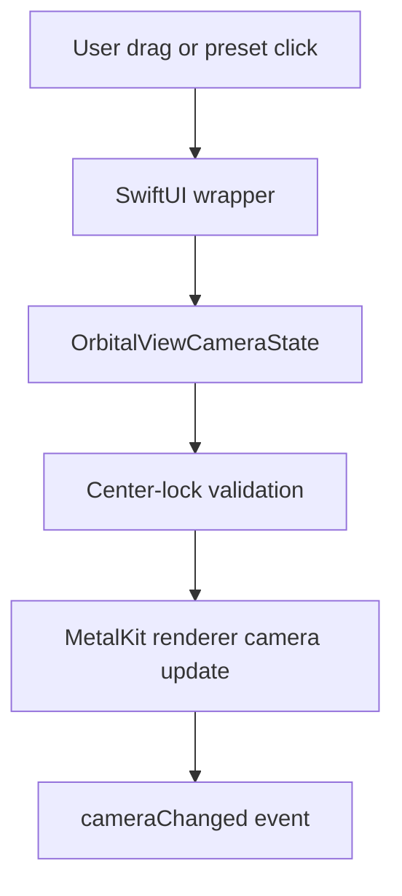
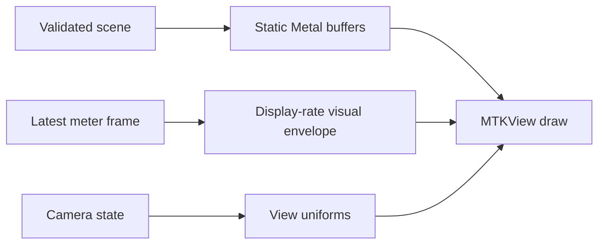
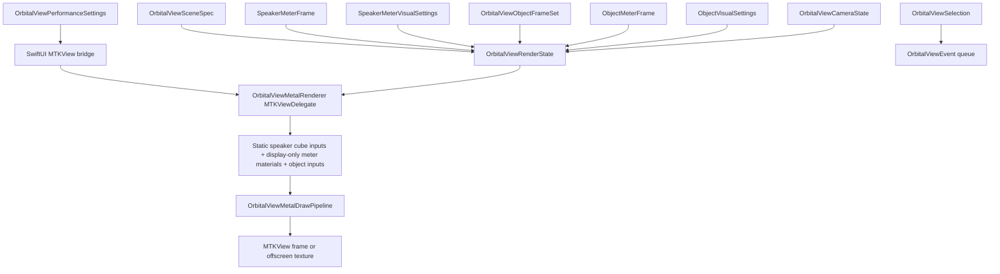
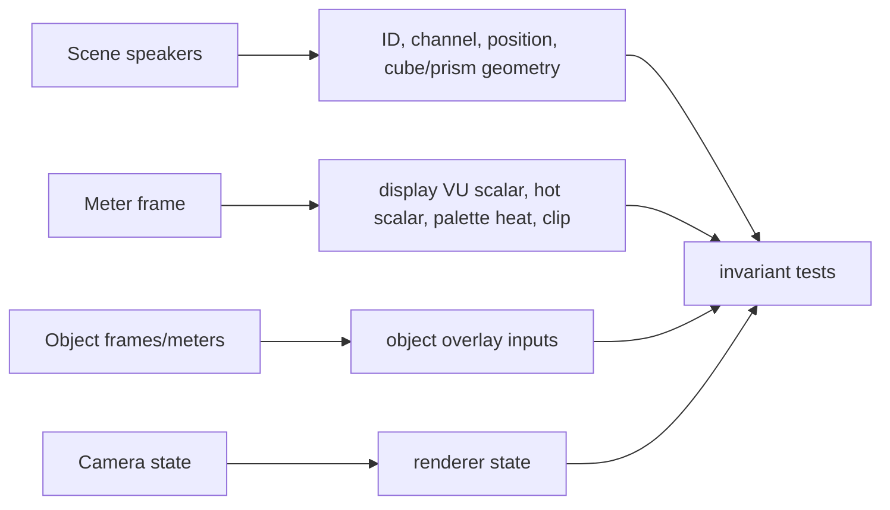
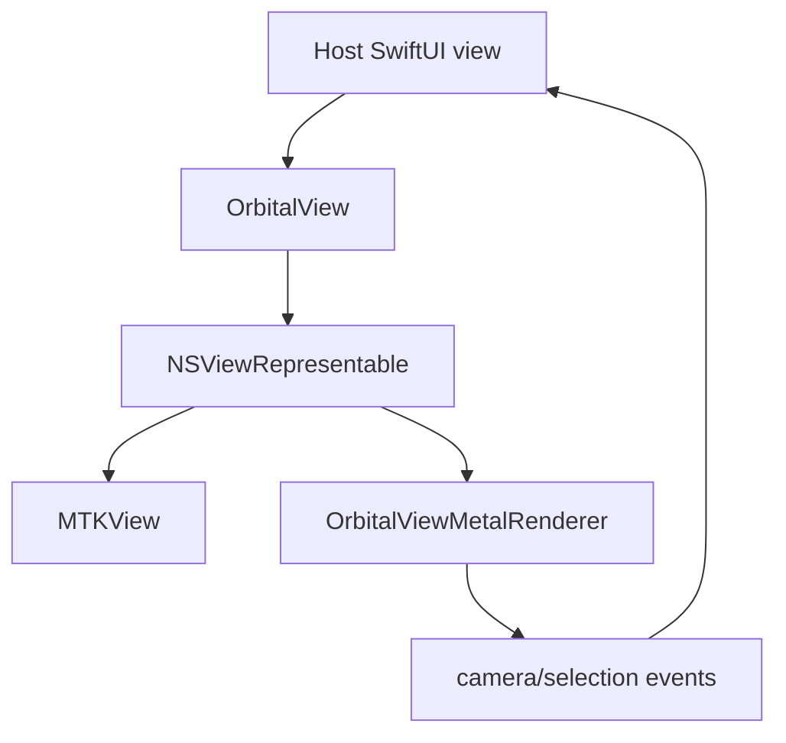
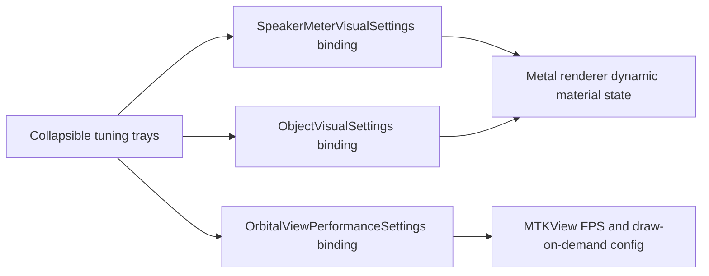
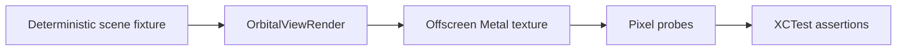
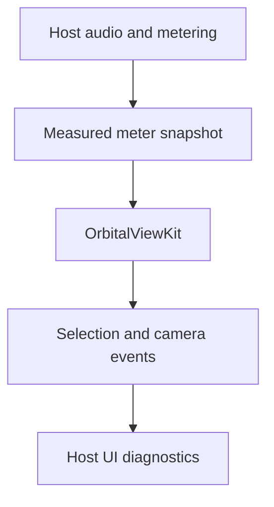

# System Flows

## Current Scaffold Flow

## Future Monitor Data Flow

## Future Camera Flow

## Future Renderer Frame Flow

Static geometry, meter state, and camera state should stay separate so meter updates do not rebuild the scene.

## Current Renderer Seam Flow

The current renderer seam stores validated state, emits camera/selection events, and issues Metal draw commands for instanced cube/prism speakers plus separate object overlay quads.

## Current Renderer Invariant Flow

Meter, camera, cube-setting, and object-meter updates must not change static speaker draw inputs. Speaker meters affect display-only material values, while object frames/meters remain a separate renderer layer.

## Current SwiftUI Wrapper Flow

The current wrapper bridges state into the renderer seam. It does not implement toolbar controls, gestures, hit testing, or inspector UI yet.

## Current Tuning Tray Flow

Speaker VU, calibration, surface/bloom, object overlay, trails, bounds, performance, presets, and diagnostics are host-facing controls. They tune visual/render settings only; they do not own host audio, playback, routing, MIDI, OSC, or meter timing.

## Current Offscreen Harness Flow

The current drawing harness proves non-empty offscreen output without opening a host app or using live audio.

## Boundary Flow

Orbital View Kit consumes measured state and emits UI-facing events. It does not own audio timing, playback, routing, MIDI, OSC, or output behavior.
