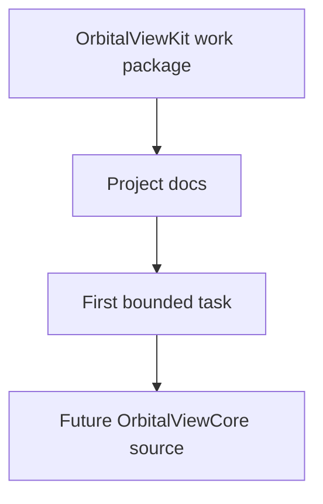
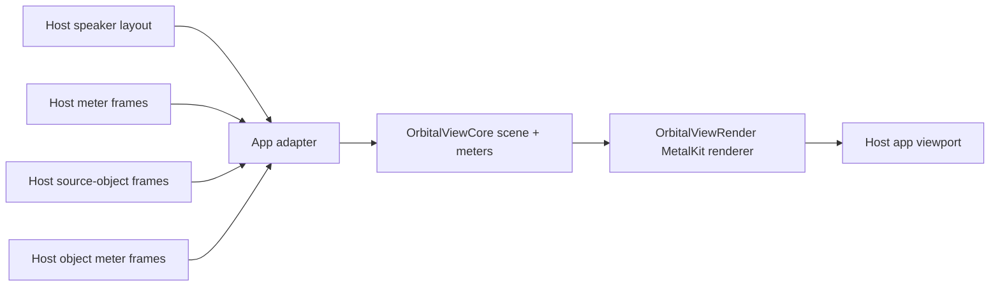
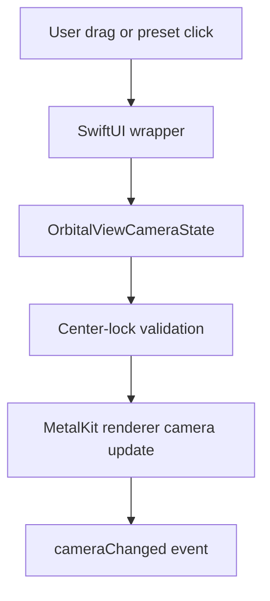
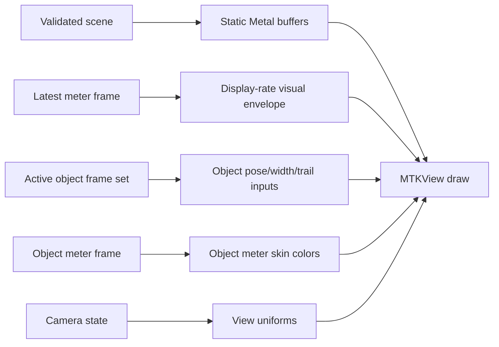
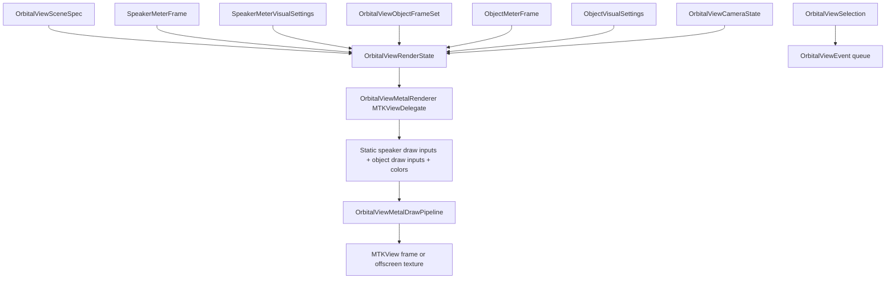
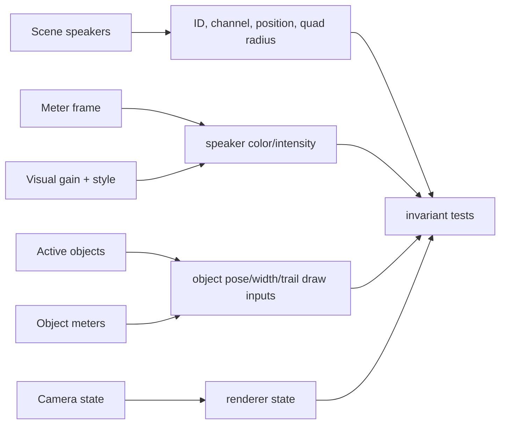
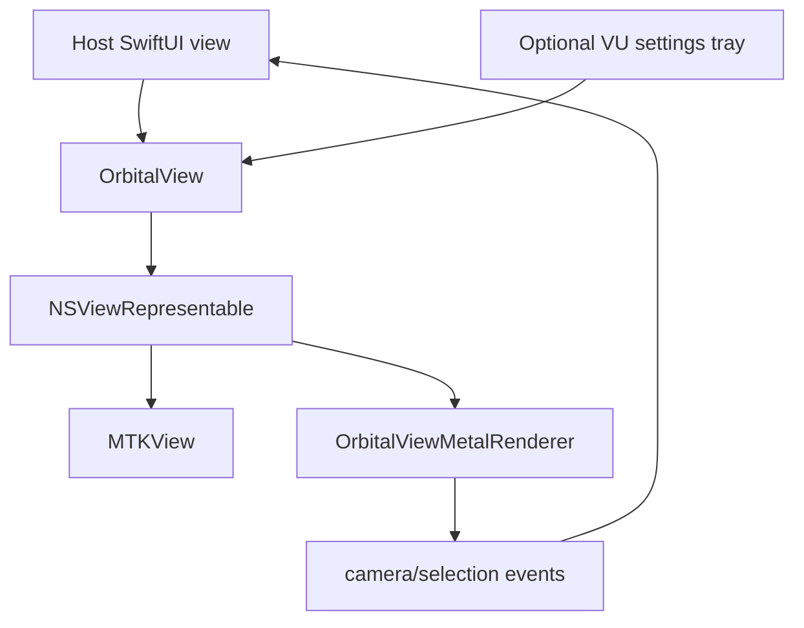
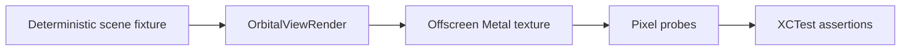
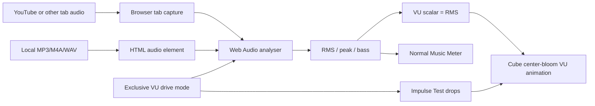
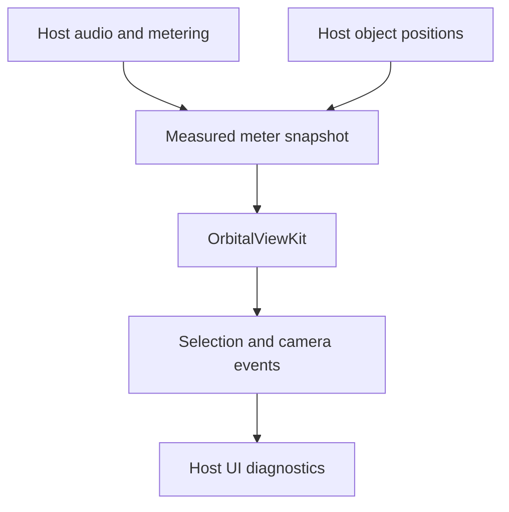

# System Flows

## Current Scaffold Flow

## Future Monitor Data Flow

## Future Camera Flow

## Future Renderer Frame Flow

Static speaker geometry, object pose/trail state, meter state, and camera state should stay separate so meter or trail updates do not rebuild the scene.

## Current Renderer Seam Flow

The current renderer seam stores validated state, emits camera/selection events, applies display-only speaker and object visual settings, and issues a minimal Metal draw command for fixed-size speaker/object quads.

## Current Renderer Invariant Flow

Meter, meter visual setting, object meter, trail, and camera updates must not change the static speaker draw inputs. Speaker meter and display-setting changes affect color/intensity only in the current renderer baseline. Object disappearance is represented by removal from the active object frame set, which also removes trail draw-input ownership.

## Current Object Overlay Flow

Object centers stay canonical unit-sphere directions. The render/effect bounds default to `-5...+5` on x, y, and z; clipping affects object trails/glow/debug visuals, not canonical poses.

## Current SwiftUI Wrapper Flow

The current wrapper bridges state into the renderer seam and can show an optional collapsed VU settings tray. It forwards object snapshots and settings without per-frame SwiftUI-owned animation state. It does not implement toolbar controls, gestures, hit testing, or inspector UI yet.

## Current Offscreen Harness Flow

The current drawing harness proves non-empty offscreen output without opening a host app or using live audio.

## Current Browser Mockup Music Flow

This flow is limited to the disposable browser mockup. Music mode lets the user hear music while the page analyzes browser audio, sets the cube VU scalar equal to the RMS percent, and blooms cube faces outward from that scalar. Peak and bass remain visible diagnostics. Impulse Test mode stops browser audio capture/playback and uses only artificial drops. It does not change `OrbitalViewCore`, `OrbitalViewRender`, `OrbitalViewSwiftUI`, host app routing, or production meter ownership.

## Boundary Flow

Orbital View VU Kit consumes measured state and emits UI-facing events. It does not own audio timing, playback, routing, MIDI, OSC, or output behavior.
